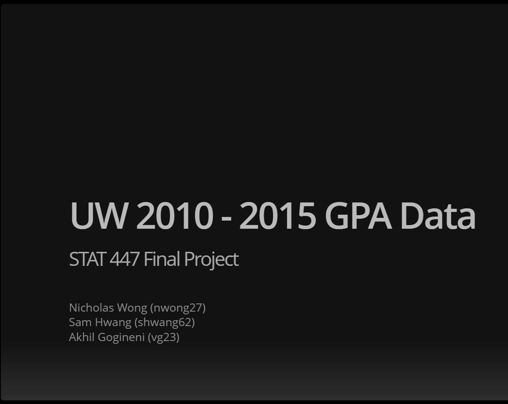
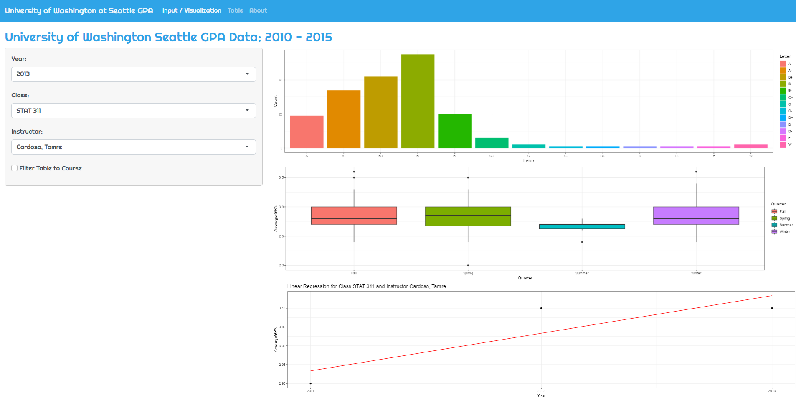

# STAT-447-Final-Project
UIUC STAT $447$ Final Project - University of Washington Seattle (UW) GPA Data: $2010 - 2015$ Shiny Application

## Authors and Contributions / Peer Evaluations

-   **Name:** Nicholas Wong
-   **Email:** [nwong27\@illinois.edu](mailto:nwong27@illinois.edu)
-   **Contributions:** Created the Project Slides, found the `UWgpa.csv` dataset, implemented majority of Shiny App code in `app.R`        including the dropdown menus and visualizations (Histograms), and wrote the `README.md` file
-   **Name:** Akhil Gogineni
-   **Email:** [vg23\@illinois.edu](mailto:vg23@illinois.edu)
-   **Contributions:** Implemented visualizations (Box plots) in the Shiny App code located at `app.R` and recorded the presentation       video found in a University of Illinois Box Link
-   **Name:** Sam Hwang
-   **Email:** [shwang62\@illinois.edu](mailto:shwang62@illinois.edu)
-   **Contributions:** Implemented visualizations (Linear Regression plot) in the Shiny App code located at `app.R` and wrote the 
    Project Report located at `Final-Project-Report.pdf`

## Project Proposal

# Purpose 

The purpose of this application is to analyze the data set of course grades from the University of Washington Seattle. For analysis, 
we chose a dataset of class information for each class taught at the University of Washington Seattle from Fall $2010$ to Fall $2015.$ We were particularly interested in the breakdown of the letter grading within each class and performed exploratory data analysis, 
like top $10$ best and worst performing classes in each year. This data is anonymized and can be manipulated to highlight features which can be important to current University of Washington Seattle students. Using our visualizations and this data, the user can discover which classes have a higher average GPA when stratified by year. Through the Shiny app, the users have the ability to dynamically explore how the average GPA for certain classes, taught by certain instructors, has changed over the specified years. In doing so, the linear regression analysis we provided helps show the trend of GPA over time, illustrating improvements and declines in class performance.

## Data

The data here comes from a Final Project $3$ students from the University of Washington Seattle worked on in a course they took called INFO $201$: Technical Foundations of Informatics. The dataset is primarily divided up into $20$ columns which consists of the Year, Quarter, Class, Title, Instructor, Student Count, Average GPA, and $13$ columns for letter grades (A, A-, B+, B, B-, C+, C, C-, D+, D, 
D-, F, and W). We decided to have the app be filtered mainly by $3$ of these columns, which are the Class, Instructor, and Year. The 
Class would be conditionally dependent on the Year and the Instructor would be conditionally dependent on both the Class and Year.

## Shiny App Example

Shiny App of University of Washington Seattle GPA Data from $2010 - 2015$ when Year = $2013$, Class = STAT $311$, and Instructor =  Cardoso, Tomre displaying histograms, box plots, and linear regression plot. 

## Presentation

[University of Illinois Box Link](https://uofi.box.com/s/94umxij6i5yk37o8rt81q6qxhfk45l75)

## Files

- Final Project Report: Located at `Final-Project-Report.pdf`
- Final Project Slides: Located at `Final-Project-Slides.pdf`, code at `Final-Project-Slides.Rmd`
- Shiny App Code: Located at `app.R`

## References
-  [University of Washington Seattle Grades Dataset from Info 201 Course Grades](https://github.com/joshkeating/info-201-coursegrades/)
-  [University of Washington Seattle: Standard Grading System](https://www.washington.edu/students/gencat/front/Grading_Sys.html)
-  [UWgpa.csv Dataset](https://github.com/joshkeating/info-201-coursegrades/blob/master/resources/UWgpa.csv)